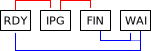
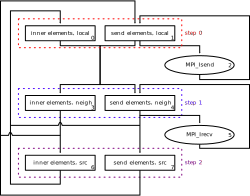
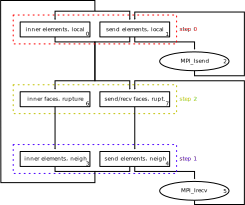
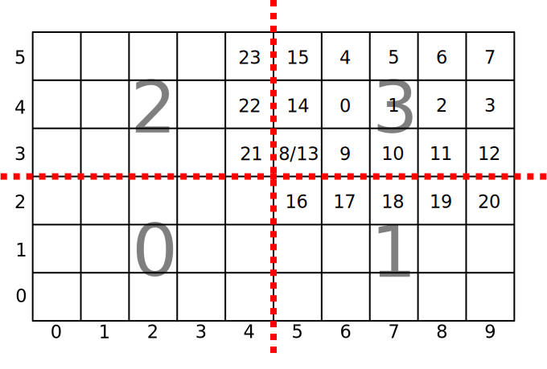
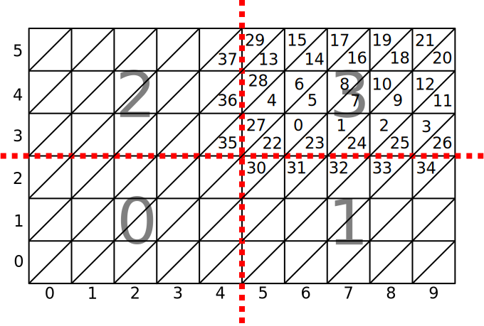
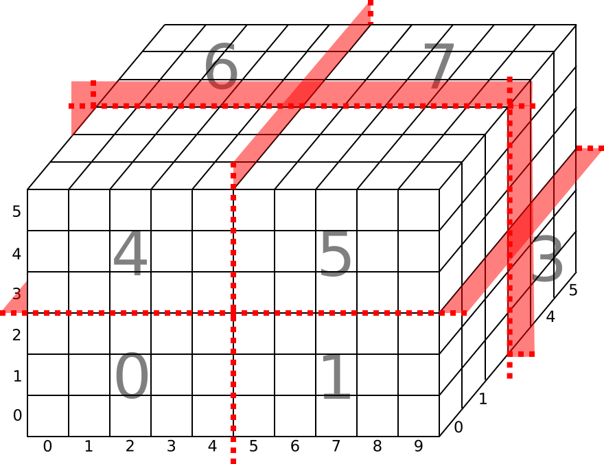

# Parallelization

## Shared Memory
We separate between three type of threads.
Workers perform computations on entities.
The unique scheduling thread manages dependencies of the time groups by 1) deciding what work (time group+step) is allowed to be done by the workers and 2) posting communication messages for distributed memory parallelization.
The last type of threads are the communication threads progressing the MPI-communication.
A thread might be a pure worker, a pure scheduling thread or a pure communication thread.
However, combinations are also allowed meaning that a thread could be a worker and a scheduling thread, a worker and a communication thread, a worker+sched+comm thread, or a scheduling thread and a communication thread.

Based on all available threads $$n_\text{th}=n_\text{wo}+1+n_\text{co}$$, we assign the first $$1\ldots n_\text{wo}$$ threads to be the $$n_\text{wo}$$ workers.
Thread $$n_\text{wo}+1$$ is the scheduling thread and threads $$n_\text{wo}+2, \ldots, n_\text{wo}+2+n_\text{co}$$ are assigned to be the $$n_\text{co}$$ communication threads.

### Work Packages
Each of the $$n_\text{wo}$$ workers is responsible for a set of work packages.
Following our entity setup, we equally distribute the entities of every time group-inner and time group-send combination to separate work packages.

Assume, for example, that rank 0 owns entities of time group #1.
Here, we distribute the inner-entities of time group #1 to $$n_\text{wo}$$ work packages, such that every worker has a unique set of entities of these inner-entities.
Analogue, we distribute the send-entities of time group #1 to $$n_\text{wo}$$ work packages, such that every worker has a unique set.
For inner-entities covering the largest time group, we can most probably ensure a good load balancing since the load is high general.
However, there might only exist a few inner- and especially send-entities for a specific time group.
A non-blocking shared memory implementation, allowing workers to jump to work packages as early as possible, is key.

For this purpose, we define a status for every work package, which is used to signal between the workers and the scheduling thread.
The possible values are _RDY_ (ready), _IPG_ (in progress), _FIN_ (finished), or _WAI_ (waiting to be scheduled).

From a worker's perspective _WAI_ means, that this work package is not ready to be progressed.
This could either be because of ongoing, unfinished communication or because other workers are not finished with work packages, imposing dependencies.
Once the scheduling threads decides, that a work package is ready to be worked on, it switches the corresponding status to _RDY_.
This means that the respective worker is allowed to jump in and work on the package.
However, each of the workers decides dynamically, which of the owned work packages with status _RDY_ has highest priority.
We prioritize by 1) work packages built of send-entities and 2) time step groups with smaller time step having higher priority.

Once a worker decided to work on a specific package, it switches its state from _RDY_ to _IPG_, signaling that it is working on the package.
Once the worked is finished with the package, it switches its state from _IPG_ to _FIN_.
At this point, the scheduling thread can use this information to resolve possible dependencies.
If the work package is directly ready to be worked on again, the scheduling thread switches the status from _FIN_ to _RDY_.
Otherwise, the scheduler switches it from _FIN_ to _WAI_, meaning that the work package is idle for the time being until new information allows it to be _RDY_ again.

### Scratch Memory
If requested by the application, EDGE provides scratch memory for shared memory parallelizations (see `parallel/global.h`).
This memory is thread-private.

## Message Passing Interface (MPI)
For interaction with MPI, we separate between a scheduling thread and communication threads.
The single scheduling thread posts new outgoing messages (send) and incoming messages (receives) via `MPI_Isend` and `MPI_Irecv`.
In addition, the scheduling thread assigns a communication thread to every message.
If the id `-1` is used, the message is progressed by all communication threads, otherwise only by the corresponding thread.
The assigned communication thread might change with every new posted message.
Possible messages are given by send-elements and receive elements for all time groups.

Communication threads continuously iterate over all possible messages and check if new requests arrived for them.
In the case any new responsibility arrived for a thread, it is added to a thread-private list hosting all of the thread's messages.
Each communication thread iterates over its list (if not empty) multiple time using `MPI_Test` to progress MPI before checking for new messages again.

We assign each message a unique identifier (tag), which is based on all possible time group combinations.
If $$n_\text{tgrps}$$ describes the number of time groups for the entire domain, this gives a total of $$n_\text{tgrps} \times n_\text{tgrps}$$ possible values for the tag.

## Scheduling

## Meshes
We support two type of meshes, regular meshes and unstructured meshes.
Regular meshes are generated at runtime and based on regular domain decompositions into lines (1D), quads (2D) or hexes (3D).
In contrast, the unstructured meshes are read from disk and parsed through the library [MOAB](http://sigma.mcs.anl.gov/moab-library/).

## Regular
**Remark:** The current implementation does not respect the inner-send-recv-ordering for the vertices; additionally global ids of entities are set to dummy values only.

### Quad
In 2D we divide a given quadrilateral domain first in quadrilateral elements.
In the next step we derive the partitions.
Next, for each MPI-rank we derive the element ids and adjacency info.

### Tria
Triangular domain decomposition follow the quadrilateral layout by splitting each quad in two triangles.

### Hex

### Tet
The tetrahedral domain decomposition follows the hexahedral layout by splitting each hex in five tets.
We use the two splittings/types A and B in alternating order to reach a conforming tetrahedral mesh.

Therefore, in the case of periodic boundaries, the number of hexes in every dimension is required to be a multiple of 2.

## Unstructured
Unstructured triangular and tetrahedral meshes are support through [MOAB](http://sigma.mcs.anl.gov/moab-library/).

### Global Ids
We define global ids (unique identifiers across all ranks) for vertices, faces and elements.
In the case of vertices and elements we reproduce the initial ids as defined in the mesh-file (tested for gmsh-only), for faces we use the ids provided by MOAB's `assign_global_ids`.
This differentiation is important since `assign_global_ids` overwrites the original mesh ids.
Therefore our approach ensures consistency for element- and vertex-ids, even when different numbers of ranks are involved.
For example, this allows following initialization-routines to perform unique mappings to reference elements and thus to ensure bit-reproducibility.
